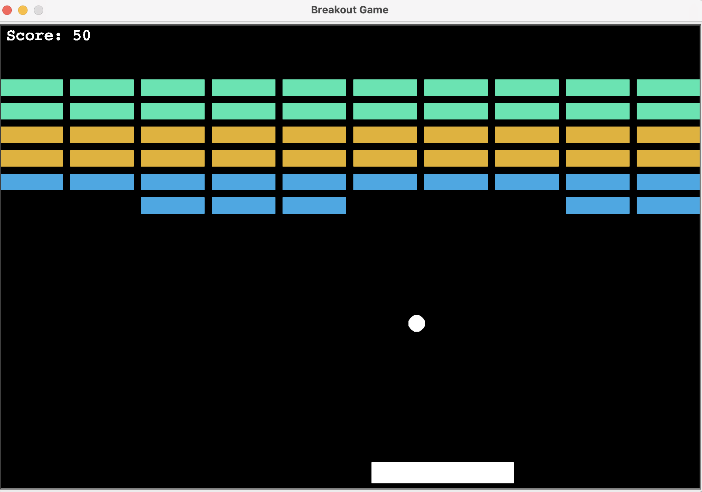
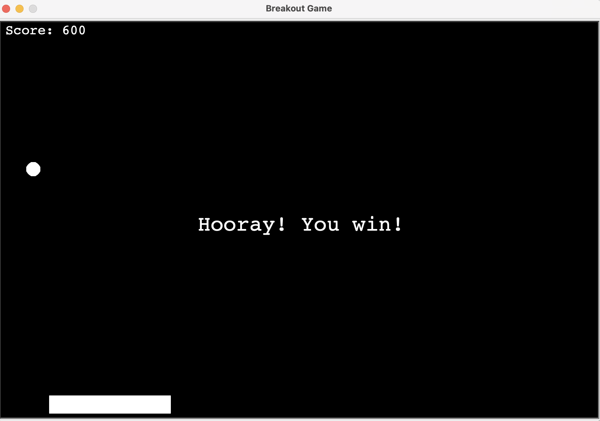
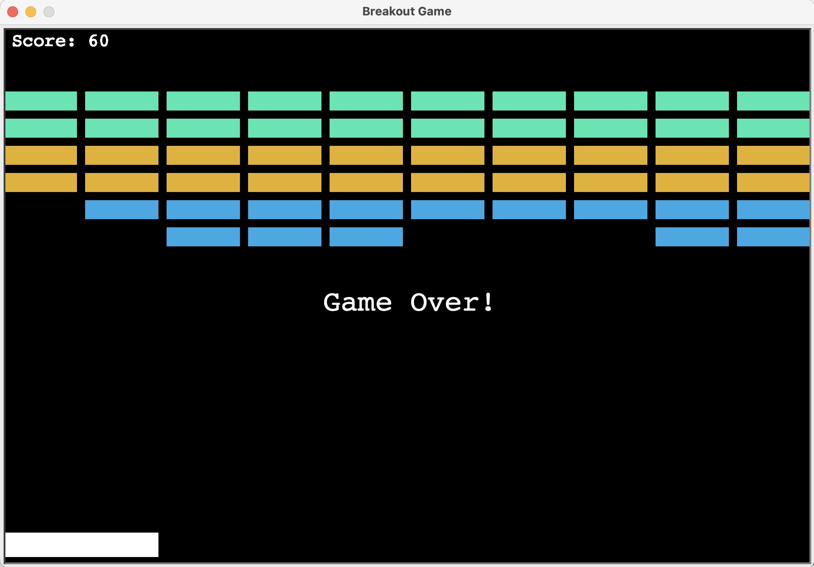

# The Breakout Game
Breakout is a fun and simple arcade game. The goal is to use a paddle to bounce a ball and break all the blocks at the top of the screen.

You move the paddle to keep the ball from falling. When the ball hits a block, the block disappears and your score increases. The game ends when all blocks are cleared (you win!) or if the ball falls below the paddle (you lose).

